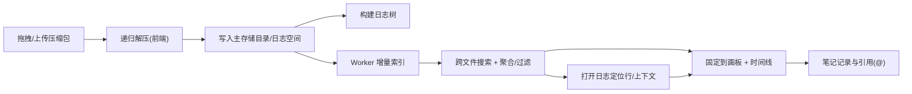

<!--
Logger Spirit README
Keep this file aligned with the current implementation.
-->

# Logger Spirit 🧊🔎


纯前端日志解压、跨文件搜索与问题分析工作台（Next.js + File System Access API）。面向云原生系统导出的“多层嵌套压缩包日志”（例如按 namespace/pod/container 拆分打包），用于快速定位线上问题。

## 目录 📌

- [为什么做它](#为什么做它-)
- [主要能力](#主要能力-)
- [快速开始](#快速开始-)
- [使用流程](#使用流程-)
- [画板快捷操作](#画板快捷操作接近-excalidraw-)
- [样例数据](#样例数据-)
- [数据落盘与目录结构](#数据落盘与目录结构主存储目录-)
- [技术栈与架构](#技术栈与架构-)
- [FAQ / 排障](#faq--排障-)
- [安全与隐私](#安全与隐私-)
- [贡献指南](#贡献指南-)
- [License](#license-)
- [文档](#文档-)

## 为什么做它 🧭

很多云原生平台导出的日志会按 `namespace/pod/container` 拆包，并且经常出现“zip 里套 zip / tar.gz”的结构。排障时你往往只知道一个关键字（timeout、traceId、error code），却不知道它在哪个 pod 的哪个文件里。

Logger Spirit 的目标是：

- ✅ 把“多包、多层嵌套”的日志快速展开成树，能直接定位与阅读
- ✅ 用跨文件搜索 + 过滤聚合 + 时间线，把线索收敛到“可解释的故障路径”
- ✅ 用笔记 + 画板，把过程变成可复盘、可协作的证据链

## 主要能力

- 🌐 纯前端：所有解析/索引/搜索都在浏览器内完成，日志落盘到你选择的本地主存储目录。
- 🧩 递归解压：拖拽或点击上传 `zip / tar.gz`，支持多层嵌套（zip in zip、zip in tar.gz、zip 里套 tar.gz 等）。
- 🗂️ 多日志空间：一个主存储目录下可并存多个“日志空间”，Tab 管理，单击激活 Tab 可重命名（名称不可重复）。
- 🧱 三栏工作台：
  - 🌲 左侧：日志树（快速过滤、只看命中、命中 badge、命中后自动展开到文件且可一键撤销）
  - 📄 中间：多 Tab 日志查看 + 跨文件搜索（正则/实时/上下文窗口/过滤与聚合）
  - 📝 右侧：问题记录本（富文本）+ 🧠 线索画板（可拖拽日志块、绘制图形、时间线辅助）
- 🧵 Web Worker：索引与搜索放到 Worker，主线程保持交互流畅。
- 🕒 自动抽取：timestamp/traceId/spanId，生成跨文件事件时间线；并对常见异常模式自动打标签（timeout、connection refused、retry storm 等）。

## 环境要求

- Node.js 20+（本地开发）
- Chrome / Edge（需支持 File System Access API；Safari/Firefox 通常不可用或能力受限）

## 快速开始 🚀

```bash
npm install
npm run dev
```

打开 `http://localhost:3000`。

## 使用流程 🧪

1. 首次进入页面，按提示选择“主存储目录”（用于保存所有日志空间与解压后的日志）。
2. 在左侧“日志空间”Tab 里新增或切换空间。
3. 在左侧顶部虚线框区域“拖拽或者点击上传日志压缩包”，系统会递归解压并生成日志树。
4. 中栏输入关键字跨文件搜索：支持正则、实时、上下文窗口；支持按 pod/container/namespace/level/时间段过滤与聚合。
5. 点击搜索结果可定位到具体文件行；也可拖拽结果/日志行到画板进行梳理。
6. 右侧笔记支持 `@` 插入文件引用并跳转；画板支持便签/文字/线/矩形/椭圆/箭头等工具。

## 画板快捷操作（接近 Excalidraw）🧷

- `Ctrl/⌘ + 滚轮`：缩放
- `滚轮`：平移画布（上下/左右）
- `Space + 拖拽`：平移画布
- `Shift`：约束方向（画线/箭头角度吸附；矩形/椭圆等比；拖拽时锁定水平/垂直）
- `Alt + 拖拽`：复制拖拽（选中对象时）
- `Backspace / Delete`：删除选中对象
- 框选：选择工具下在空白处拖拽框选多选
- 对齐/吸附：拖拽时出现对齐参考线

## 样例数据 🧰

仓库内包含可复现的样例压缩包与生成脚本，便于验证“递归解压 + 建树 + 搜索 + 时间线 + 画板联动”等能力。

生成并验证样例：

```bash
bash scripts/generate-sample-archives.sh
npx --yes tsx scripts/validate-sample-archives.ts
```

输出位于 `sample-data/generated/`：

- `incident-alpha-2026-02-12.zip`
- `incident-beta-2026-02-12.zip`
- `search-hints.json`

## 数据落盘与目录结构（主存储目录）💾

你选择的主存储目录下，会为每个日志空间创建一个子目录；解压后的日志会存放在对应空间目录中（便于你直接在本地查看/备份/迁移）。

说明：

- Logger Spirit 需要目录读写权限来保存解压结果与索引数据。
- 该项目不会自动上传你的日志到网络；但请你自行确认浏览器环境/扩展/系统策略是否符合安全要求。

## 技术栈与架构 🏗️

- Next.js 16（App Router）
- React 19
- TypeScript 5
- File System Access API（本地目录读写）
- Web Worker（索引/搜索）
- fflate（zip/tar.gz 解压）

核心数据流（简化）：



## 常用命令 🛠️

```bash
npm run lint
npm run build
npm run start
```

## FAQ / 排障 🧯

- 为什么我看不到“选择主存储目录”的权限弹窗？
  - 请确认使用 Chrome/Edge，并且站点不是 `http://` 的受限环境；必要时在浏览器设置里允许该站点访问文件。
- 为什么导入后树是空的？
  - 先确认压缩包内确实存在文本日志；也可能是压缩包只包含二进制文件（系统会跳过不可读文本）。
- 为什么搜索比较慢？
  - 首次索引需要时间；建议先缩小范围（过滤 pod/container/namespace/level/时间段），或减少 `maxResults`。

## 安全与隐私 🔒

- 日志内容默认只在你的浏览器与本地目录中处理与保存。
- 请在可信浏览器环境下使用，并谨慎安装可能读取页面内容的扩展。
- 如果你在公司设备/受管浏览器中使用，请遵循组织的数据安全政策。

## 贡献指南 🤝

- 欢迎提 Issue：复现步骤、样例压缩包结构（可脱敏）、期望行为、实际行为、截图/录屏。
- 欢迎提 PR：尽量保持改动小而聚焦，并附带必要的说明或测试脚本。

## Roadmap（可持续优化方向）🗺️

- 画板：Undo/Redo、更多对齐策略、对齐到网格、对象属性面板
- 搜索：更大规模日志的虚拟列表渲染、更强的聚合视图、可保存的查询集合
- 分析：Trace/Span 链路还原、自动聚合错误簇、Pod/Container 关联视图

## License 📄

MIT License。详见 `LICENSE`。

## 文档 📚

- 设计笔记：`docs/log-search-design.md`
